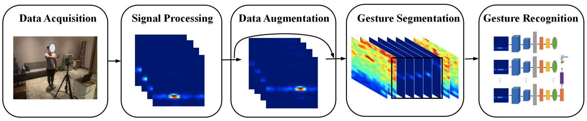

# Gesture Recognition with mmWave Radar
## Code repository for the paper: Towards Domain-independent and Real-time Gesture Recognition using mmWave Signal, IEEE TMC, 2022.

Authors: [Yadong Li](https://yadongli.com), [Dongheng Zhang](http://staff.ustc.edu.cn/~dongheng/), Jinbo Chen, Jinwei Wan, Dong Zhang, Yang Hu, [Qibin Sun](https://ustc-ip-lab.github.io/authors/qibinsun/), and [Yan Chen](https://ustc-ip-lab.github.io/authors/yanchen/)

Affiliation: [Intelligent Perception Lab](https://ustc-ip-lab.github.io/), University of Science and Technology of China. [Paper Link](https://arxiv.org/pdf/2111.06195)



## Introduction
- This code repository mainly includes two parts:

  - **Signal Processing:** Pre-processing the raw FMCW signal to get the dynamic range angle image (DRAI) as described in the paper.  

  - **Deep Learning:** A CNN-LSTM neural network that inputs DRAI and outputs gesture labels. 

- Both the signal processing and deep learning code can be used to support other similar applications using wireless signals.

<div align=center>
    
</div>
<div align=center>
    
</div>

## How to Access the Code

The [USTC IP Lab](https://ustc-ip-lab.github.io/) has particular protocols for releasing the code and dataset. To access the code, please sign the [agreement](datasetAgreement.pdf), scan and send it to yadongli@mail.ustc.edu.cn or yadongli@uw.edu. A notification email that includes the code will be sent within three days.

## Installation and Setup

## Run Demo

## Citing
If you find this code useful for your research, please consider citing the following papers:
```
@ARTICLE{9894724,
  author={Li, Yadong and Zhang, Dongheng and Chen, Jinbo and Wan, Jinwei and Zhang, Dong and Hu, Yang and Sun, Qibin and Chen, Yan},
  journal={IEEE Transactions on Mobile Computing}, 
  title={Towards Domain-Independent and Real-Time Gesture Recognition Using mmWave Signal}, 
  year={2023},
  volume={22},
  number={12},
  pages={7355-7369},
  doi={10.1109/TMC.2022.3207570}}

```

```
@INPROCEEDINGS{10001175,
  author={Li, Yadong and Zhang, Dongheng and Chen, Jinbo and Wan, Jinwei and Zhang, Dong and Hu, Yang and Sun, Qibin and Chen, Yan},
  booktitle={GLOBECOM 2022 - 2022 IEEE Global Communications Conference}, 
  title={DI-Gesture: Domain-Independent and Real-Time Gesture Recognition with Millimeter-Wave Signals}, 
  year={2022},
  volume={},
  number={},
  pages={5007-5012},
  doi={10.1109/GLOBECOM48099.2022.10001175}}
```
